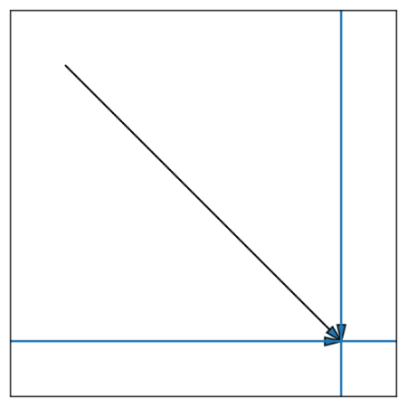

## Propriedades Vectora:

- text: ;  ---> propriedade referente ao texto do elemento.

- color: ; ---> propriedade referente a cor do elemento.

- background.color ---> propriedade para cores em containeres.

- transform: ; ---> propriedade geral que mantém o efeitos finais de animações.

- radius: ; ---> propriedade referente ao raio de curvatura de um elemento.

- gap: ; ---> propriedade referente a distância entre dois elementos ou mais.

- weight: ; ---> propriedade referente ao peso de um texto de um elemento.

- sound: ; ---> propriedade referente a emissão de som.

- brightness: ; ---> propriedade referente a claridade de um elemento.

- shadow: ; ---> propriedade referente a simulação de sombra de um container.

- text.shadow: ; ---> propriedade de sombra específica para textos.

- value: ; ---> propriedade de valor (Explicação mais detalhada na seção de "Eventos assíncronos").


## Animações Vectora: 

- [x] text ==
    - land(duração) ---> animação de queda suave do texto.

    - rise(duração) ---> animação de subida suave.

    - slideIn(origem, distância, duração) ---> animação de deslize do texto.

    - slideOut(sentido, distância, duração) ---> animação de deslize para fora.

    - fadeIn(duração) ---> animação de surgimento.

    - fadeOut(duração) ---> animação de desaparecimento.

    - pop(intensidade, duração) ---> animação de explosão.

    - implode(intensidade, duração) ---> animação de implosão.

    - shiver(intensidade, duração) ---> animação de tremedeira.

    - shake(direção, intensidade, duração) ---> animação que depende da direção que pode ser até 3 tipos ==
        - "seesaw": "gangorra" -> diagonal; 
        - "cocktail-shaker": "coqueteleira" -> vertical;
        - "sideways": "laterais" -> horizontal;
    
    - spin(sentido, graus, duração) ---> rotaciona o texto através de um sentido, horário ou anti-horário, em uma certa duração.

- [x] color == 
    - fadeColor(cor final, duração) ---> animação de aparecimento da cor

    - chameleonCamo(cor final, duração) ---> animação de troca de cor, de dentro para fora.

    - octopusCamo(cor final, duração) ---> animação de troca de cor, de fora para dentro.

    - paint(sentido, cor final, duração) ---> colore conforme a sentido.

    - liquidFill(sentido, cor final, duração) ---> colore como se estivesse enchendo de algum líquido.

- [x] transform ==
    - rotate(sentido, intensidade, duração) ---> rotaciona o texto através de um sentido, horário ou anti-horário, em uma certa duração, perdurando sua posição.

    - zoomIn(intensidade, duração) ---> aproxima o elemento, perdurando a animação. 

    - zoomOut(intensidade, duração) ---> afasta o elemento, perdurando a animação.

    - mirror(intensidade, duração) ---> inverte e espelha o elemento.

- [x] radius ==
    - round(intensidade, duração) ---> muda do estado inicial de border-radius para o estado final com uma transição simples.

    - corner(borda específica, intensidade, duração) ---> arredonda um canto específico em um certo período de tempo.

- [x] gap ==
    - bloom(gap final, duração) ---> transita do gap inicial para o final sem preferência.

    - stagedBloom(sentido (vertical/horizontal), duração) ---> transita do gap inicial para o final com preferência referenciada.

- [ ] weight ==
    - skinny(escala, duração) ---> multiplica o peso da fonte pela escala em porcentagem.
    
    - heavy(escala, duração) ---> divide o peso da fonte pela escala em porcentagem.

- [ ] sound ==
    - play(path) ---> toca o som em loop.

    - pause(duração) ---> pausa o som por um certo período de tempo.

    - stop(sem parâmetro) ---> para de tocar o som.

- [ ] brightness ==
    - halo(intensidade, cor, duração) ---> cria uma luz envolta do texto.

    - fadeLight(intensidade original, duração) ---> desfaz uma luz envolta do texto.

    - neon(cor, direção, intensidade) ---> cria uma luz neon no texto dependendo da direção.

    - pillar(cor, intensidade) ---> cria um pilar de luz.

- [x] shadow ==
    - surge(direção, intensidade, duração) ---> cria uma sombra dependendo da direção, com intensidade definida.

    - fadeDusk(duração) ---> desfaz uma sombra em certo tempo.

    - purge(duração) ---> rotaciona a sombra para o lado oposto ao seu.

- [ ] value == 
    - proposeValue(nome da variável root) ---> cria um objeto que guarda propriedades pré-estabelecidas.

    - searchValue(nome da variável root) ---> executa as animações presentes no objeto.


##  Eventos Vectora:

- [x] DOMContent.onLoad ==
    Assim que o DOM for carregado, realiza uma animação.

- [x] window.onLoad ==
    Assim que a página for totalmente carregada, a animação acontece.

- [x] reveal.onScroll ==
    Realiza a animação assim que for revelado pelo scroll lateral da página.

- [x] hide.onScroll ==
    Assim que escondido pelo scroll, realiza uma animação.

- [x] onSing.click == 
    Executa a animação ao clicar uma vez em cima do elemento.

- [x] onDbl.click ==
    Executa a animação com um clicar duplo em cima do elemento.

- [x] onHold.click ==
    Executa a animação com o segurar de um clique.

- [x] onSelection.click ==
    Quando um elemento é selecionado, realiza a animação.
####DONE####

##  Soma e Concatenação de Animações =

O programa define quando vai ser soma ou concatenação através de um filtro de familia. Cada animação tem uma familia, sendo elas as familias dos Vetoriais, Escalares e Adimensionais. Quando duas animações são de familias diferentes, o resultado sempre vai ser uma soma. Já se as familias forem iguais, dai vai ser uma concatenação.

Existe apenas uma excessão que é quando a animação é de família Vetorial, pois na familia vetorial existem as subfamilias Horizontal, Vertical e Diagonal. Quando as duas ou mais animações forem de familia Vetorial, dai o filtro leva em conta a subfamilia. Se não, as subfamilias não são utilizadas.

Naturalmente, as animações possuem uma singularidade, ou são animações de entrada, ou são animações de saída, ou são indefinidas. Isso por si só impacta no jeito em que o operador funciona, pois é IMPOSSÍVEL concatenar duas animações de entrada ou saída. Até porque não se pode entrar duas vezes no mesmo lugar, sem antes sair pelo menos 1 vez. Mas é possível somar essas duas.

A resultante da soma/concatenação da animação são chamadas de interpolações.

> Ambas simbolizadas pelo (++).

### Soma =

Na soma de animações, ocorre a junção das propriedades de cada, formando uma nova interpolação sem nome. Isso pode ser explicado utilizando vetores da *Física*. 

Imagine duas setas, ambas apontando para o mesmo centro, mas uma é totalmente horizontal e a outra é totalmente vertical. Ao somar essas duas, você consegue uma resultante diagonal com 45° ângulares. Essas setas são as movimentações e a resultante é nada mais que a soma dessas mesmas.

<pre>exemplo {
    window.onLoad {
        text: land() ++ slideIn();
    };
} </pre>



> A trajetória esperada da soma das animações, para o elemento "exemplo" é a seta resultante representada na diagonal. 

### Concatenação Simples =

Durante uma concatenação, as animações são colocadas em sequência sem intervalo de tempo entre uma e outra. Pode-se usar como exemplo a concatenação das animações:

<pre>exemplo {
    window.onLoad {
        text: slideIn() ++ slideOut();
    };
}</pre>

- A animação slideIn é executada primeiro e, ao seu término, a slideOut é executada imediatamente.


### Concatenação Induzida =

A concatenação de animações de famílias diferentes em uma é feita através de um símbolo universal. Esse símbolo representa que, a função antes e depois serão postas em sequência e não somadas.

> O símbolo de concatenação induzida é: +-

<pre>exemplo {
    window.onLoad {
        text: slideIn +- rise();
    };
} </pre>

### !! NÃO RECOMENDADO !! Soma Induzida =

A soma induzida de animações de famílias iguais é reconhecida através de um símbolo universal. Não é recomendado seu uso pois os resultados podem ser imprevisíveis.

> O símbolo de soma induzida é: #

```
exemplo {
    window.onLoad {
        text: slideIn() # slideOut();
    };
}
``` 
> Saida esperada é uma animação suave de ida sem volta, sem pausas como acontece naturalmente com a concatenação

## Manipulação de Interpolação =

Uma interpolação nada mais é que o resultado obtido da soma/concatenação de duas ou mais animações. Suas propriedades podem ser livremente manipulados, bastando apenas seguir uma síntaxe indicadora utilizando o simbolo "=>".

<pre>exemplo {
    window.onLoad {
        text: land() ++ slideIn() => ;
    };
}</pre>

- Sendo assim, com o indicador "=>" é possível definir qual será a animação que vai executar ao final da interpolação:

<pre>exemplo {
    window.onLoad {
        text: land() ++ slideIn() => fadeOut();   
    };
}</pre>

* Ao final da interpolação, em sequência, a animação de fadeOut será executada.

- Além disso, é possível definir propriedades à interpolação, através do símbolo "&". Sendo necessário o juste da posição de propriedade para antes de qualquer animação.

<pre>exemplo {
    window.onLoad {
        text: land() ++ slideIn() => &ease-in;   
    };
}</pre>

- Definir propriedades para certas interpolações dentro de uma interpolação geral é feita usando o o princípio de leitura do interpretador, que é da esquerda para a direita.

<pre>exemplo {
    window.onLoad {
        text: land() ++ slideIn() => &ease-in => fadeOut() => &ease-out;   
    };
}</pre>


## Intervalos na Execução = 

Através de um símbolo especial, é possível definir o intervalo de tempo entre a execução da primeira e segunda animação CONCATENADA, sendo necessário colocar um valor númerico. O número só é aceito se ele estiver colado com o "--". Se houver espaços em branco entre ele e o número, dá erro!

> Reforçando que o símbolo é o (--)

```
exemplo {
    window.onLoad {
        text: slideIn +- ~rise() => --1000ms;
    };
} 
```

> "~" representa o símbolo inversor, rise() é uma animação de entrada e seu inverso se torna uma animação de saída.

Outros exemplo seria fazendo uma concatenação com a interpolação e aplicando o delay entre a interpolação e a animação.

```
exemplo {
    window.onLoad {
        text: land() ++ slideIn() => slideIn() => --1000ms;         
        // 1 segundo de delay entre a interpolação (land() ++ slideIn()) e o slideIn()
    };
}
```


## Inversor =

É possível inverter a funcionalidade de uma animação utilizando o operador "~". Essa animação invertida pode ser uma catalogada como o caso do inverso da slideIn, que é a slideOut. Ou podem ser não-catalogadas, sendo assim, o programa decide como lidar com ela.

O símbolo deve vir antes da animação. Pois ele não se importa com o conteúdo a esquerda dele.

```
exemplo {
    window.onLoad {
        text: ~land();                      
        <!-- Inverso da land é a hook, uma animação catalogada exclusivamente para o inversor -->
    };
}
```

```
exemplo {
    window.onLoad {
        color: ~fadeColor();
        <!-- Inverso da fadeColor não é catalogada! -->
    };
}
```


## Contador = 

 Ao adicionar o símbolo '%%' a frente de uma animação, é possível criar um contador que adiciona 1 valor a contagem toda vez que aquela animação for executada.
 Colocando um valor aleatório a direita do símbolo fará com que ele retorne true toda vez que o número de contagem for igual ao número ao lado do contador.
```
exemplo {
    window.onLoad {
        text: land() %%5;               <!-- Retorna true quando o valor da contagem for igual a 5 -->
    };
}
```

- Adicionar um 'x' a direita do símbolo fará com que ele retorne true toda vez que o valor contado for par.
```
exemplo {
    window.onLoad {
        text: land() %%x;               
        <!-- Retorna true toda vez que o valor contado for par -->
    };
}
```

- Adicionar um valor a direita do 'x' fará com que ele retorne true toda vez que o número da contagem for divisível pelo número.
```
exemplo {
    window.onLoad {
        text: land() %%x5               
        <!-- Retorna true toda vez que o valor contado for divisível por 5 -->
    };
}
```


## Identificador = 

Tratadas pelo símbolo '*', os identificadores são cadeias de caracteres que apontam para uma linha específica de um específico arquivo. Não podem ser exportadas ou importadas, apenas usadas no contexto daquele arquivo.

Identificadores usam strings que estão juntas do símbolo '*'. Se houver um espaço em branco entre o símbolo e a string, o identificador não vai dar certo.

```
exemplo {
    window.onLoad {
        text: land() *land-principal-exemplo;
    };
}
```

##  Elementos Assíncronos = 

* São elementos que não existem no HTML, mas que atuam em um papel fundamental na lógica da DSL. Um exemplo de elemento assíncrono é o **@vectora**, o qual é o elemento que permite usar os eventos assíncronos.

```
@vectora {
    eventos assíncronos... {};
}
```

- Outro elemento assíncrono a ser citado:
    - *cmd* ---> parte backend, com lógica padrão de linguagens com criação de variáveis, statements e loops.

Exemplo de uso do cmd:
- dentro do arquivo .vec
```
// principal estrutura de código a ser executada. O main não precisa ser chamado para sua execução. 
@cmd(parâmetros)main {

    // '$' é como se fosse o 'let' e o '$$' é o 'const' do Vectora
    $$id = QueryId('slide-h1');
    $retorno = CounterReturn(id);
    $contagem = CounterValue(id);

    // '??' representa a palavra-chave condicional IF
    ?? retorno == true:
    -   terminal.print("A animação executou {$} vezes.", contagem);
        // As '-' são importantes para representar as linhas de comando dentro do statement.

    // '!?' representa o a palavra-chave condicional ELSE IF (ELSIF em outras linguagens)
    !? retorno == true && contagem == 10:
    -   terminal.print("A animação executou 10 vezes."); 

    // '!!' representa o a palavra-chave condicional ELSE
    !! :
    -   terminal.write("Animação executada, contador não retornou TRUE, dados a seguir.");
    -   terminal.print("id: {$}\n retorno: {$}\n contagem: {$}\n", id, retorno, contagem);

        // write sempre escreve os valores em strings.
        // print escreve os valores de variáveis utilizando o {$} dentro das aspas.
}

h1 {
    window.onLoad {
        text: slideIn() *slide-h1 %%x2;
    };
}
```

##  Eventos Assíncronos =
    
* Eventos assíncronos nada mais são do que eventos que não necessitam de um gatilho para ser executado. O melhor exemplo disso é o evento **import** que permite importar bibliotecas tanto internas quanto externas.

<pre>
@vectora {
    import {
        whensevent
    };
}
</pre>

- Outros eventos assíncronos a serem citados:
    - *media* ---> aplica animações conforme o tamanho da tela do usuário.

    - *import* ---> importa aplicações e outras bibliotecas.

    - *charset* ---> define a codificação do arquivo.

    - *layer* ---> cria uma camada de ordem de prioridade entre blocos.


